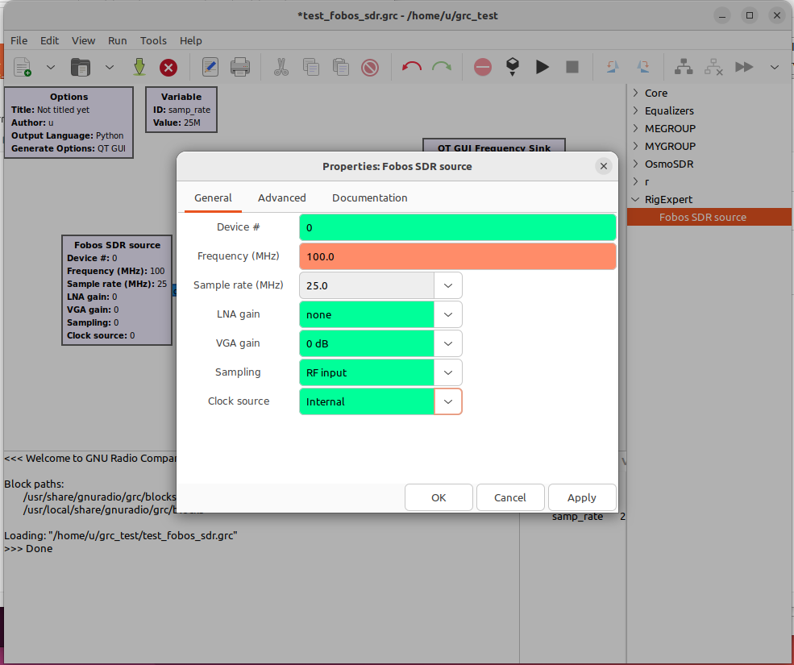
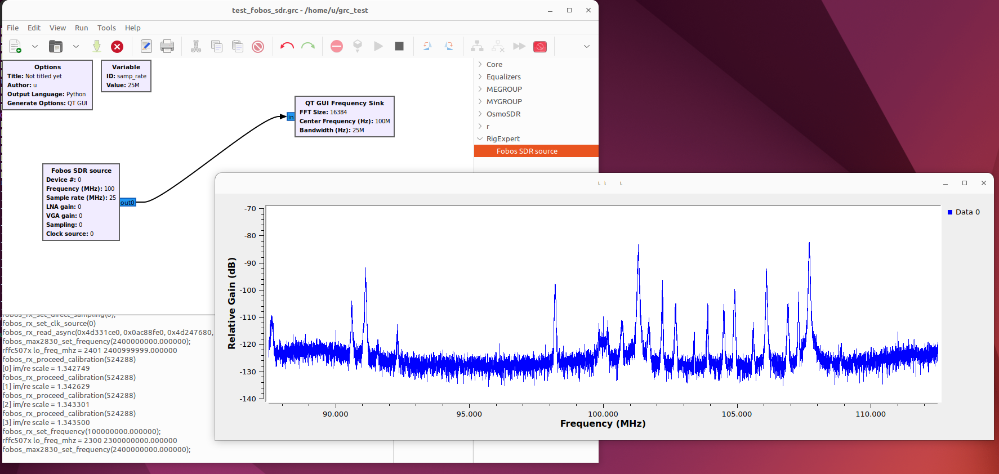
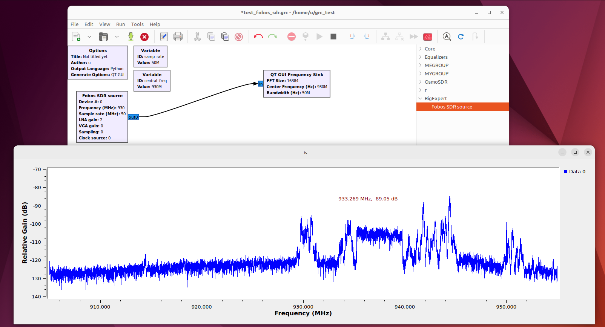

# RigExpert Fobos SDR source block

This is the Fobos SDR receiver Complex IQ signal source block for GnuRadio. Full sourse code.

## Requirements

- Ubuntu 22.04 LTS
- GnuRadio v.3.10

## Dependencies

- libusb-1.0-0-dev 2:1.0.25

## How to build and install

git clone [this repo] 
cd gr-rigespert 
sudo cp fobos-sdr.rules /etc/udev/rules.d/00-fobos-sdr.rules 
sudo udevadm control --reload-rules 
sudo udevadm trigger 
mkdir build 
cd build 
cmake .. 
make 
sudo make install 
sudo ldconfig 

## How to use

Nothing special.
- Place Fobos SDR source on the GRC worksheet
- Connect output node to other nodes
- Run and have a fun

## How it looks like

 
 
 

## What is actually Fobos SDR

For more info see the main product page

https://rigexpert.com/en/products/kits-en/fobos-sdr/
